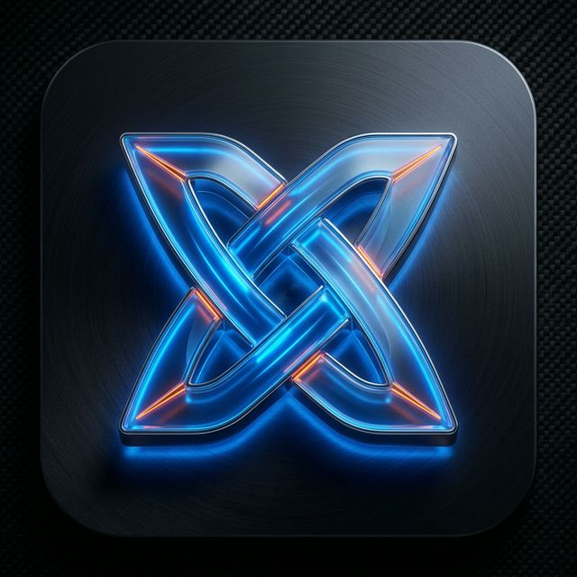

# 
 NEXUS BROWSER

  <strong>O Navegador de Alta Performance com Foco em Segurança e Personalização.</strong> 
  <em>Privacidade Inabalável. Design Premium. Velocidade Extrema.</em>

---

## 🚀 O que é o Nexus?

O **Nexus Browser** foi construído para entregar uma experiência de navegação moderna, limpa e altamente segura. Combinamos a simplicidade que você já conhece com uma camada de segurança robusta e uma interface totalmente customizável que se adapta ao seu estilo.

### ✨ Por que escolher o Nexus?

*   🛡️ **Nexus Shield:** Navegue sem anúncios e rastreadores. O Nexus bloqueia silenciosamente o que te atrapalha.
*   ⚡ **Smart Omnibox:** Barra de endereço futurista com sugestões inteligentes e busca integrada.
*   🎨 **Sua Cara, Suas Cores:** Personalize o tema e as cores de destaque em segundos.
*   🔍 **Navegação Premium:** Interface fluida, rápida e pensada na sua produtividade.

---

## 📥 Download e Instalação

Para começar a usar o Nexus Browser agora mesmo, basta seguir os passos abaixo:

1.  Acesse a seção de **[Releases](https://github.com/victorpgdev/NexusWeb/releases)**.
2.  Baixe o arquivo mais recente: `Nexus Browser Setup X.X.X.exe`.
3.  Execute o instalador e pronto! O Nexus será instalado e atualizado automaticamente para você.

---

  

---

  Fabricado com ❤️ para a nova era da web.

